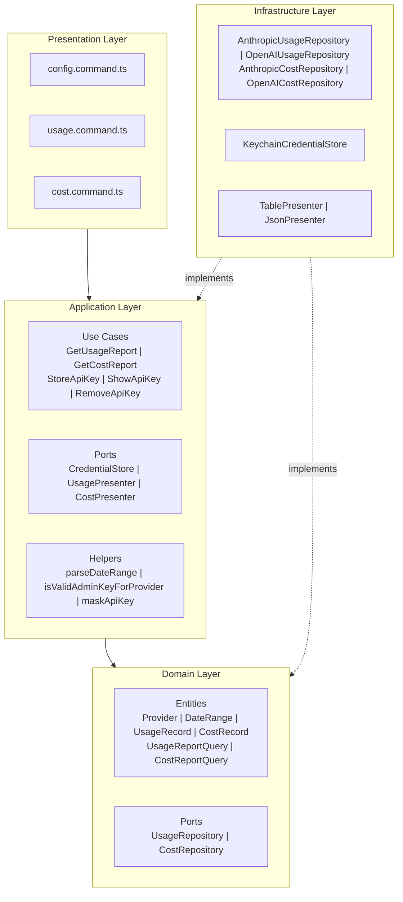
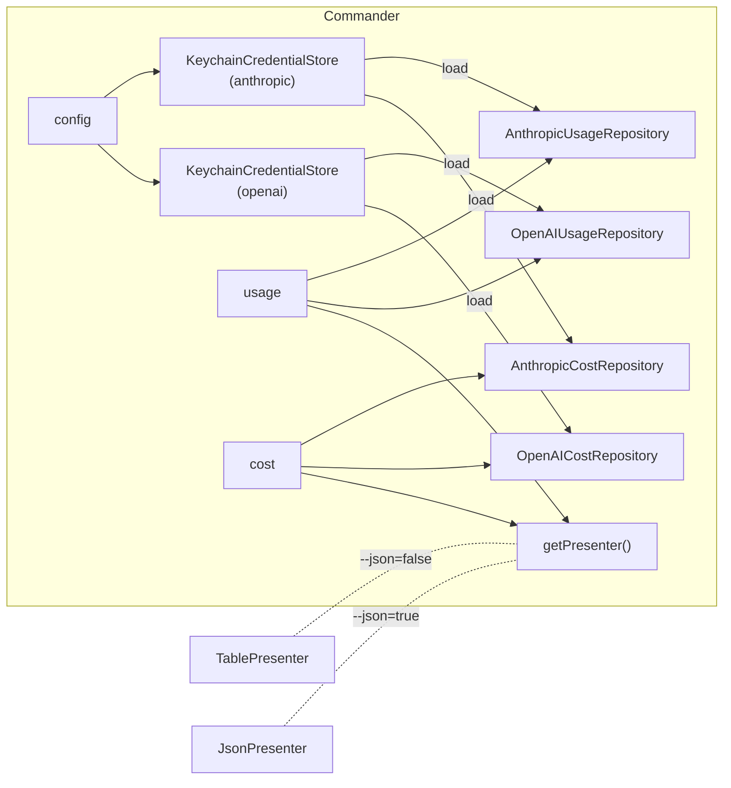
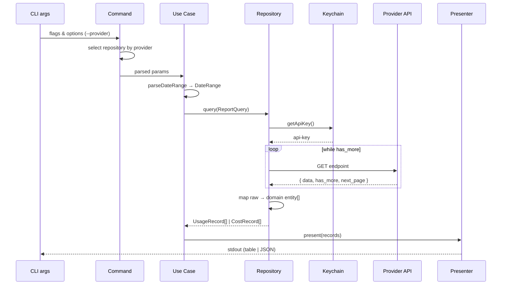
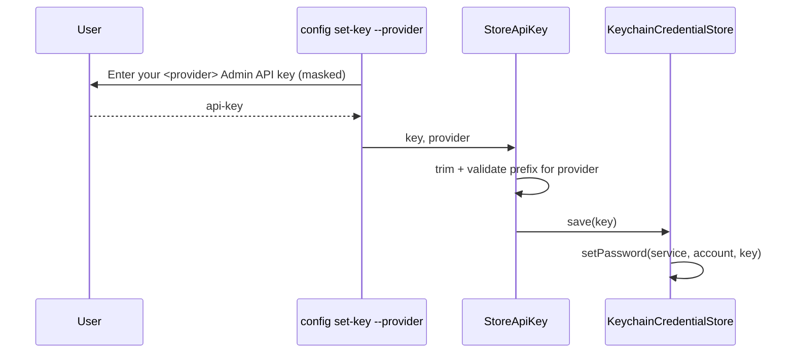

# Architecture

## Overview

**llm-cost-cli** -- CLI-утилита для получения отчётов об использовании токенов и расходах через Anthropic и OpenAI Admin API. Результаты выводятся в формате таблицы или JSON. API-ключи хранятся в системном keychain.

- **Package**: `llm-cost-cli`
- **Binary**: `llm-cost`
- **Platform**: macOS, Linux, Windows (cross-platform keychain via cross-keychain)
- **Runtime**: Node.js >= 18
- **Module system**: ESM

## Tech Stack

| Category | Tool | Version |
|----------|------|---------|
| Language | TypeScript | 5.9 |
| CLI framework | commander | 14.x |
| Interactive prompts | @inquirer/prompts | 8.x |
| Table output | cli-table3 | 0.6.x |
| Colors | chalk | 5.x |
| Keychain | cross-keychain | 1.x |
| Bundler | tsdown | 0.20.x |
| Linter / Formatter | Biome | 2.x |

## Architectural Pattern

Приложение следует принципам **Clean Architecture** (Hexagonal / Ports & Adapters):

## Layer Details

### Domain Layer (`src/domain/`)

Содержит чистые типы данных и порты репозиториев. Не имеет зависимостей на внешние пакеты.

**Entities** (value objects):
- `Provider` -- идентификатор LLM-провайдера (`'anthropic' | 'openai'`)
- `DateRange` -- временной диапазон запроса
- `UsageRecord` -- запись об использовании токенов (с полем `provider`)
- `CostRecord` -- запись о расходах (с полем `provider`)
- `UsageReportQuery` -- параметры запроса usage
- `CostReportQuery` -- параметры запроса cost

**Ports** (repository interfaces):
- `UsageRepository` -- получение данных об использовании
- `CostRepository` -- получение данных о расходах

### Application Layer (`src/application/`)

Бизнес-логика приложения. Зависит только от Domain Layer.

**Use Cases**:
- `GetUsageReport` -- получить отчёт об использовании токенов
- `GetCostReport` -- получить отчёт о расходах
- `StoreApiKey` -- сохранить API-ключ (с валидацией по провайдеру)
- `ShowApiKey` -- показать замаскированный API-ключ
- `RemoveApiKey` -- удалить API-ключ

**Ports** (application-level interfaces):
- `CredentialStore` -- сохранение/загрузка/удаление credentials
- `UsagePresenter` -- вывод данных usage
- `CostPresenter` -- вывод данных cost

**Helpers**:
- `parseDateRange()` -- парсинг `--period`, `--from`, `--to` в `DateRange`
- `isValidAdminKeyForProvider()` -- валидация префикса ключа по провайдеру
- `maskApiKey()` -- маскирование ключа для отображения

### Infrastructure Layer (`src/infrastructure/`)

Реализации всех портов. Единственный слой с внешними зависимостями.

| Adapter | Port | Описание |
|---------|------|----------|
| `AnthropicUsageRepository` | `UsageRepository` | HTTP-клиент к Anthropic `/v1/organizations/usage_report/messages` |
| `AnthropicCostRepository` | `CostRepository` | HTTP-клиент к Anthropic `/v1/organizations/cost_report` |
| `OpenAIUsageRepository` | `UsageRepository` | HTTP-клиент к OpenAI `/v1/organization/usage/completions` |
| `OpenAICostRepository` | `CostRepository` | HTTP-клиент к OpenAI `/v1/organization/costs` |
| `KeychainCredentialStore` | `CredentialStore` | Системный keychain через cross-keychain (macOS Keychain, Windows Credential Manager, Linux Secret Service) |
| `TablePresenter` | `UsagePresenter & CostPresenter` | Вывод в виде таблицы (cli-table3 + chalk) |
| `JsonPresenter` | `UsagePresenter & CostPresenter` | Вывод в формате JSON |

### Presentation Layer (`src/presentation/`)

CLI-команды, зарегистрированные через `commander`. Каждая команда:
1. Парсит аргументы из CLI (включая `--provider`)
2. Выбирает нужный репозиторий/хранилище по провайдеру
3. Создаёт экземпляр use case с нужными зависимостями
4. Вызывает use case
5. Обрабатывает ошибки и выводит в stderr

| Command | Use Case(s) | --provider |
|---------|-------------|------------|
| `config set-key` | `StoreApiKey` | да |
| `config show` | `ShowApiKey` | да |
| `config remove-key` | `RemoveApiKey` | да |
| `usage` | `GetUsageReport` | да |
| `cost` | `GetCostReport` | да |

## Composition Root (`src/index.ts`)

Точка входа, где собираются все зависимости:

API-ключ загружается лениво -- `credentialStore.load()` вызывается только при фактическом запросе к API.

## Data Flow

### Usage / Cost Report

### API Key Storage

## External API

### Anthropic Admin API (`https://api.anthropic.com`)

| Endpoint | Method | Path |
|----------|--------|------|
| Usage Report | GET | `/v1/organizations/usage_report/messages` |
| Cost Report | GET | `/v1/organizations/cost_report` |

**Headers**: `anthropic-version: 2023-06-01`, `x-api-key: <admin-api-key>`
**Pagination**: cursor-based через `has_more` + `next_page` token.
**API-ключ**: `sk-ant-admin...`

### OpenAI Admin API (`https://api.openai.com`)

| Endpoint | Method | Path |
|----------|--------|------|
| Usage Report | GET | `/v1/organization/usage/completions` |
| Cost Report | GET | `/v1/organization/costs` |

**Headers**: `Authorization: Bearer <admin-api-key>`
**Pagination**: cursor-based через `has_more` + `next_page` token.
**API-ключ**: `sk-admin-...`
**Даты**: unix timestamps (секунды)
**Суммы**: в долларах (не в центах как у Anthropic)

## Security

- API-ключи хранятся в системном keychain (service: `llm-cost-cli`, account: `llm-cost-cli:<provider>`) через cross-keychain (macOS Keychain / Windows Credential Manager / Linux Secret Service), никогда не записываются на диск в plaintext
- Ключи передаются только на соответствующие API по HTTPS
- Никаких config-файлов: все настройки через CLI-флаги
- Никакого кэширования: данные не сохраняются локально, вывод только в stdout

## Build & Distribution

См. [deploy.md](deploy.md)
