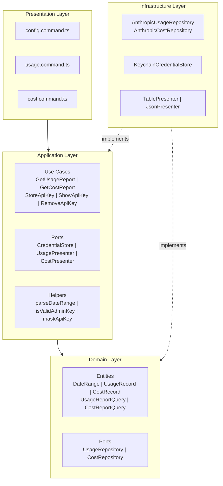
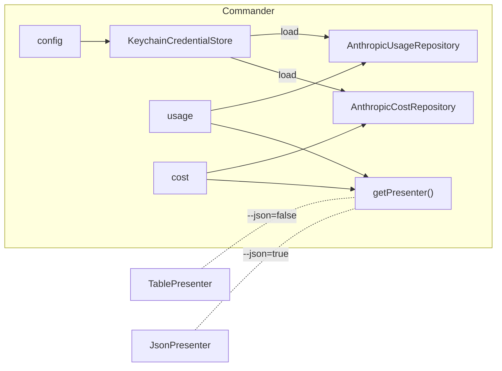
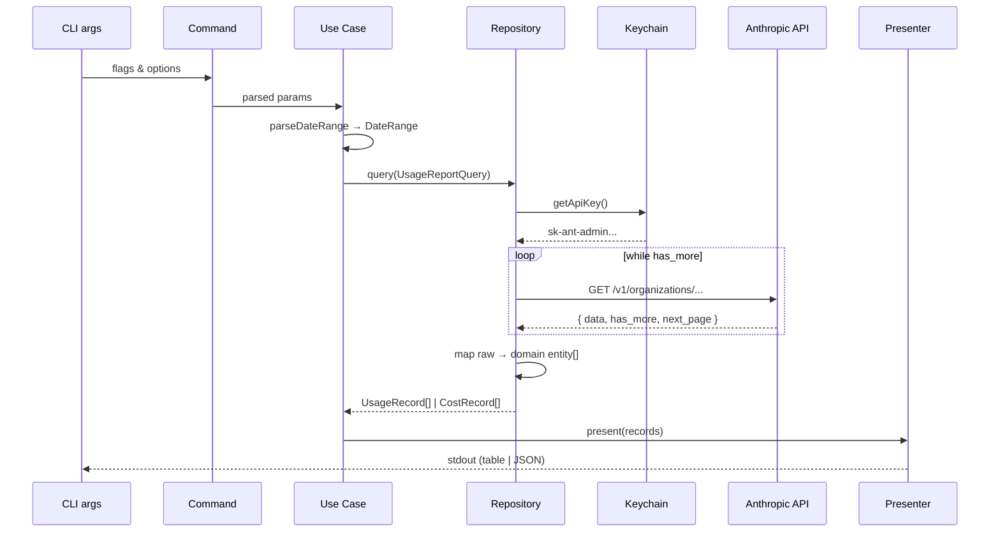
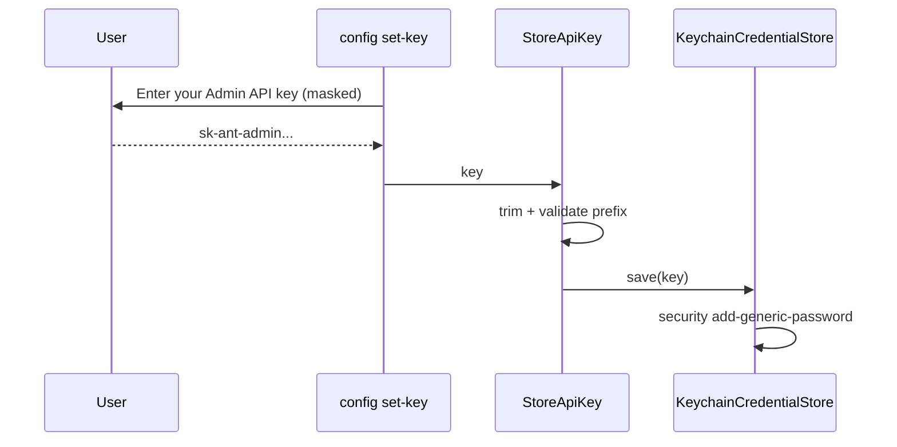

# Architecture

## Overview

**claude-cost-cli** -- CLI-утилита для получения отчётов об использовании токенов и расходах через Anthropic Admin API. Результаты выводятся в формате таблицы или JSON. API-ключ хранится в macOS Keychain.

- **Package**: `claude-cost-cli`
- **Binary**: `claude-cost`
- **Platform**: macOS (зависимость от Keychain)
- **Runtime**: Node.js >= 18
- **Module system**: ESM

## Tech Stack

| Category | Tool | Version |
|----------|------|---------|
| Language | TypeScript | 5.9 |
| CLI framework | commander | 14.x |
| Interactive prompts | @inquirer/prompts | 8.x |
| Table output | cli-table3 | 0.6.x |
| Colors | chalk | 5.x |
| Bundler | tsdown | 0.20.x |
| Linter / Formatter | Biome | 2.x |

## Architectural Pattern

Приложение следует принципам **Clean Architecture** (Hexagonal / Ports & Adapters):

## Layer Details

### Domain Layer (`src/domain/`)

Содержит чистые типы данных и порты репозиториев. Не имеет зависимостей на внешние пакеты.

**Entities** (value objects):
- `DateRange` -- временной диапазон запроса
- `UsageRecord` -- запись об использовании токенов
- `CostRecord` -- запись о расходах
- `UsageReportQuery` -- параметры запроса usage
- `CostReportQuery` -- параметры запроса cost

**Ports** (repository interfaces):
- `UsageRepository` -- получение данных об использовании
- `CostRepository` -- получение данных о расходах

### Application Layer (`src/application/`)

Бизнес-логика приложения. Зависит только от Domain Layer.

**Use Cases**:
- `GetUsageReport` -- получить отчёт об использовании токенов
- `GetCostReport` -- получить отчёт о расходах
- `StoreApiKey` -- сохранить API-ключ
- `ShowApiKey` -- показать замаскированный API-ключ
- `RemoveApiKey` -- удалить API-ключ

**Ports** (application-level interfaces):
- `CredentialStore` -- сохранение/загрузка/удаление credentials
- `UsagePresenter` -- вывод данных usage
- `CostPresenter` -- вывод данных cost

**Helpers**:
- `parseDateRange()` -- парсинг `--period`, `--from`, `--to` в `DateRange`
- `isValidAdminKey()` -- валидация префикса `sk-ant-admin`
- `maskApiKey()` -- маскирование ключа для отображения

### Infrastructure Layer (`src/infrastructure/`)

Реализации всех портов. Единственный слой с внешними зависимостями.

| Adapter | Port | Описание |
|---------|------|----------|
| `AnthropicUsageRepository` | `UsageRepository` | HTTP-клиент к `/v1/organizations/usage_report/messages` |
| `AnthropicCostRepository` | `CostRepository` | HTTP-клиент к `/v1/organizations/cost_report` |
| `KeychainCredentialStore` | `CredentialStore` | macOS Keychain через `security` CLI |
| `TablePresenter` | `UsagePresenter & CostPresenter` | Вывод в виде таблицы (cli-table3 + chalk) |
| `JsonPresenter` | `UsagePresenter & CostPresenter` | Вывод в формате JSON |

### Presentation Layer (`src/presentation/`)

CLI-команды, зарегистрированные через `commander`. Каждая команда:
1. Парсит аргументы из CLI
2. Создаёт экземпляр use case с нужными зависимостями
3. Вызывает use case
4. Обрабатывает ошибки и выводит в stderr

| Command | Use Case(s) |
|---------|-------------|
| `config set-key` | `StoreApiKey` |
| `config show` | `ShowApiKey` |
| `config remove-key` | `RemoveApiKey` |
| `usage` | `GetUsageReport` |
| `cost` | `GetCostReport` |

## Composition Root (`src/index.ts`)

Точка входа, где собираются все зависимости:

API-ключ загружается лениво -- `credentialStore.load()` вызывается только при фактическом запросе к API.

## Data Flow

### Usage / Cost Report

### API Key Storage

## External API

**Anthropic Admin API** (`https://api.anthropic.com`)

| Endpoint | Method | Path |
|----------|--------|------|
| Usage Report | GET | `/v1/organizations/usage_report/messages` |
| Cost Report | GET | `/v1/organizations/cost_report` |

**Headers**:
- `anthropic-version: 2023-06-01`
- `x-api-key: <admin-api-key>`

**Pagination**: cursor-based через `has_more` + `next_page` token.

**API-ключ**: Admin API key (`sk-ant-admin...`), даёт read-only доступ к usage и cost данным организации.

## Security

- API-ключ хранится исключительно в macOS Keychain (service: `claude-cost-cli`), никогда не записывается на диск в plaintext
- Ключ передаётся только на `api.anthropic.com` по HTTPS
- Никаких config-файлов: все настройки через CLI-флаги
- Никакого кэширования: данные не сохраняются локально, вывод только в stdout

## Build & Distribution

См. [deploy.md](deploy.md)
