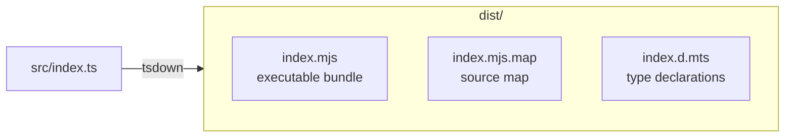
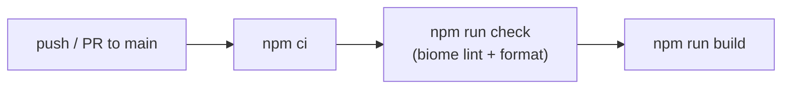
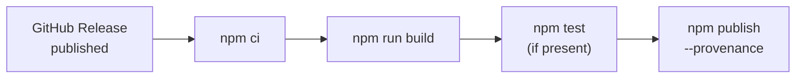

# Build & Deploy

## Build

Сборка через `tsdown` -- бандлер поверх esbuild с поддержкой TypeScript.



### Конфигурация (`tsdown.config.ts`)

| Параметр | Значение | Описание |
|----------|----------|----------|
| `entry` | `src/index.ts` | Точка входа |
| `format` | `esm` | ES Modules |
| `platform` | `node` | Платформа Node.js |
| `target` | `node18` | Минимальная версия |
| `clean` | `true` | Очистка dist/ перед сборкой |
| `dts` | `true` | Генерация type declarations |
| `sourcemap` | `true` | Генерация source maps |
| `banner` | `#!/usr/bin/env node` | Shebang для прямого запуска |
| `external` | `node:*` | Не бандлить Node.js built-ins |

### Команды

```bash
npm run build          # tsdown → dist/
npm run check          # biome check --write (lint + format)
npm run lint           # biome lint
npm run format         # biome format --write
```

## CI

**Workflow**: `.github/workflows/ci.yml`
**Trigger**: push / PR в `main`
**Runner**: `ubuntu-latest`, Node.js 20



## Publish

**Workflow**: `.github/workflows/publish.yml`
**Trigger**: GitHub Release published
**Runner**: `ubuntu-latest`, Node.js 24



### Provenance

Пакет публикуется с `--provenance` -- npm связывает каждый релиз с конкретным коммитом через GitHub Actions OIDC. Для этого workflow запрашивает permission `id-token: write`.

Проверить содержимое перед установкой:
```bash
npm pack llm-cost-cli --dry-run
```

### Что публикуется

Определено в `package.json` → `files`:
- `dist/` -- собранный бандл
- `README.md`
- `LICENSE`

## Установка

```bash
npm install -g llm-cost-cli
```

После установки доступна команда `llm-cost`.

Установка из исходников:
```bash
git clone https://github.com/cyberash-dev/claude-cost-cli.git
cd claude-cost-cli
npm install && npm run build && npm link
```

## Release Checklist

1. Обновить `version` в `package.json`
2. Создать GitHub Release с тегом (например `v0.2.0`)
3. Publish workflow запускается автоматически
4. Проверить пакет на npm: `npm info llm-cost-cli`
